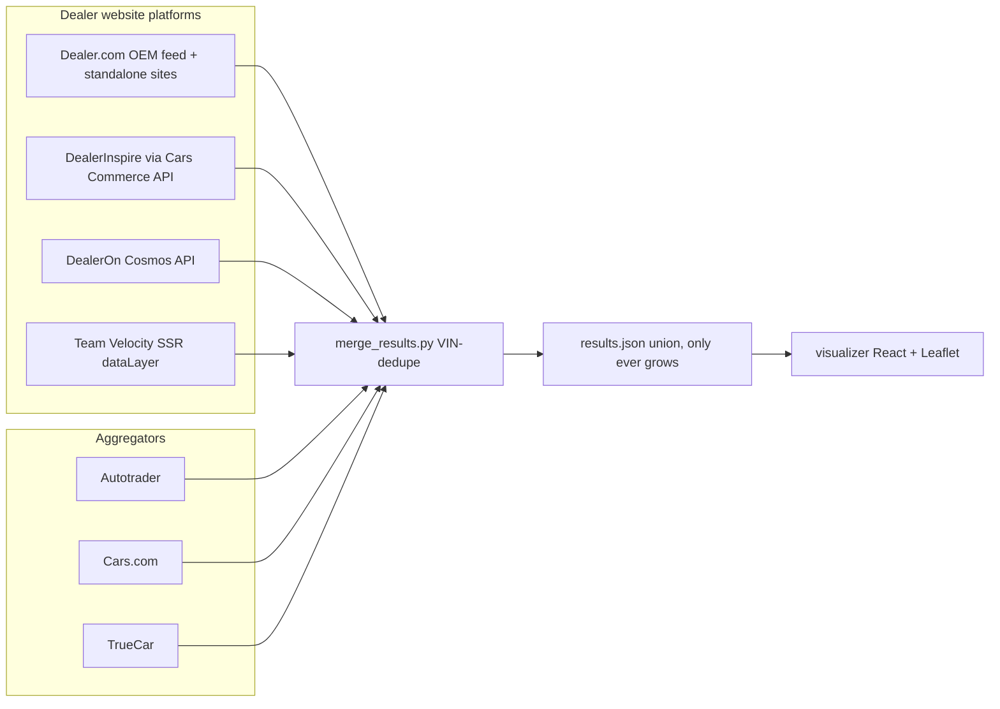

# BMW Inventory Crawler & Visualizer

Nationwide BMW dealer-inventory search across seven sources — four dealer
website platforms queried directly, plus three aggregators — merged by VIN
into one dataset and explored in a local React app with map, filters, and
purchase-tracking annotations.

Built to answer one question well: *"Where is every low-mile 2025–26 X7 M60i
(or XM, or 760i…) in the country, and what will it really cost?"*

## Where to go

| I want to… | Read |
|---|---|
| Run a search / understand the crawlers | [`crawler/README.md`](crawler/README.md) |
| Browse results on a map/table, annotate cars | [`visualizer/README.md`](visualizer/README.md) |
| See which dealers & platforms are covered | [`crawler/coverage_report.md`](crawler/coverage_report.md) |
| Get going in 5 minutes | [Setup](#setup) + [Running a sweep](#running-a-sweep) below |



## Coverage

The dealer-platform census (`crawler/coverage_report.md`) mapped all ~370 US
BMW dealerships to their website platform. Direct-crawl support:

| Platform | Dealers | How |
|---|---|---|
| Dealer.com | ~150 | One JSON query to the OEM `bmwgroup` account + per-site queries for standalone accounts |
| DealerInspire | ~120 | Cars Commerce search API, one call per dealer (`cc_ccid` harvested per dealer) |
| DealerOn | ~30 | Cosmos SRP JSON API (`dealerId`/`pageId` harvested per dealer) |
| Team Velocity | ~22 | Vehicle dataLayer parsed from server-rendered SRP HTML |

Aggregators fill in the remaining platforms (Dealer eProcess, DealerSocket, …).

## Setup

```bash
# Crawler (Python 3.10+, uv)
cd crawler
uv sync
uv run playwright install chrome   # for anti-bot browser fallbacks

# Visualizer (Node 20+)
cd ../visualizer
npm install
```

Optional: `OPENAI_API_KEY` in `crawler/.env` enables LLM ownership analysis
(`--analyze`).

## Running a sweep

Each target vehicle has a script that fans out across all seven sources and
VIN-merges the results:

```bash
cd crawler
./search_all_models.sh --sync          # X5/X6/X7 M60i + XM + 760i, 2025-26
./search_x56m.sh --year 2026           # X5/X6 M-family for one year
./search_x7_40i.sh --sync              # X7 xDrive40i
./search_760.sh                        # 7 Series 760i xDrive
./search_xm.sh --year 2026             # all XMs (min-miles defaults to 0)
```

Common flags: `--sync` (union into `results.json` + refresh visualizer),
`--skip-fetch --skip-vdp` (fast pass, no VDP/CarFax enrichment),
`--headless`, `--year Y[-Y]`, `--min-miles/--max-miles`,
`--exclude-states`, and per-source `--skip-*`.

Or query the dealer platforms directly:

```bash
uv run search_inventory.py --search "X5:M60i" --search XM --year 2025-2026
```

### Data-safety rule

`results.json` is the persistent dataset. **Searches cannot write it** — all
crawlers refuse `--out results.json` and write standalone files instead. The
only writer is `merge_results.py`, which unions by VIN and never drops
existing vehicles:

```bash
uv run merge_results.py --inputs results.json new_sweep.json --out results.json
```

## Visualizer

```bash
cd visualizer
npm run sync    # copy ../crawler/results.json into public/data/
npm run dev     # http://localhost:5173
```

Table/map/split views, faceted filters + full-text search (VIN, dealer,
color, your notes), per-VIN tags (`interesting → … → purchased/pass`) and
comments persisted to `public/data/annotations.json` via a dev-server
middleware, CarFax badges, distance-from-home sorting, dark mode. See
[visualizer/README.md](visualizer/README.md).

## Repo layout

```
crawler/
  search_inventory.py       # dealer-platform search engine (DDC/DI/DealerOn/TV)
  crawl_autotrader.py       # Autotrader crawler (Playwright + stealth)
  cars_com.py               # Cars.com crawler (requests + browser fallback)
  truecar.py                # TrueCar crawler (Apollo-state parser)
  merge_results.py          # VIN-dedupe merge / union
  search_*.sh               # per-vehicle sweep scripts (all sources + merge)
  master_dealers.json       # 377-dealer roster w/ platform + API credentials
  build_master_dealers.py   # roster builder (merge + URL verification)
  platform_census.py        # detects each dealer's website platform
  harvest_di_ccid.py        # harvests Cars Commerce ids for DealerInspire
  harvest_dealeron.py       # harvests DealerOn dealer/page ids
  coverage_report.md        # nationwide platform census results
visualizer/                 # React + Vite + Tailwind + Leaflet app
```

## Configuration notes

- **Home location** (distance sort + aggregator search origin): change
  `ORIGIN_COORDS`/`ORIGIN_LABEL` in `visualizer/src/components/VehicleTable.tsx`
  and the `zip=` / `detroit-mi` origin in the sweep scripts. Nationwide radius
  is used everywhere, so the origin only affects sorting and URL routing.
- **Default filters**: 60–15,000 miles, CA excluded (adjust per run with flags).
- Anti-bot fallbacks use persistent Chrome profiles in `~/` (created on first
  use). If a source starts blocking, run its `--warmup` once to clear the
  challenge by hand.

## Data & fair-use notes

- All data comes from public dealer/aggregator listing pages and the public
  APIs those pages call. The API keys appearing in code and
  `master_dealers.json` are the public client-side keys those sites serve to
  every visitor — no credentials are required or bypassed.
- Crawls are low-volume and targeted: specific model/trim searches, modest
  page caps, and delays between requests. Please keep it that way, and
  respect each site's terms of service when using or adapting this code.
- Inventory data, sweep outputs, and personal annotations are intentionally
  **not** tracked in git (see `.gitignore`) — a fresh clone starts with an
  empty dataset and builds its own via sweeps.
